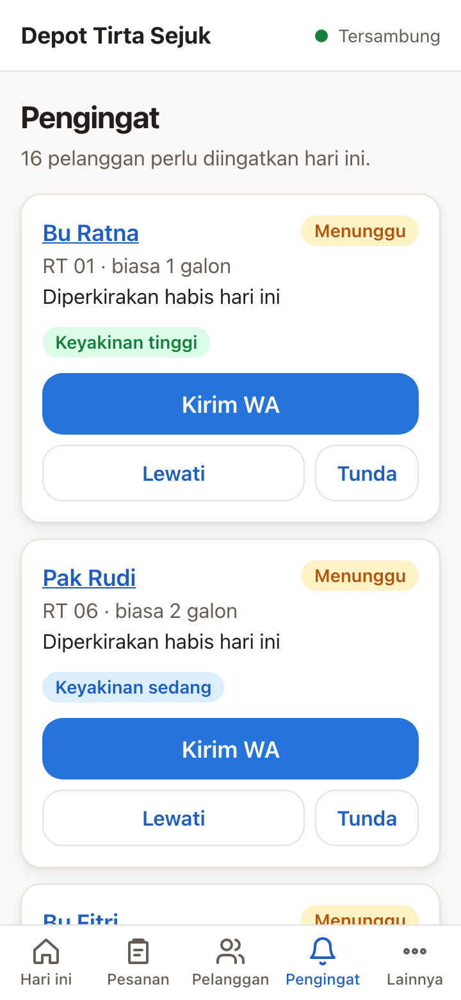
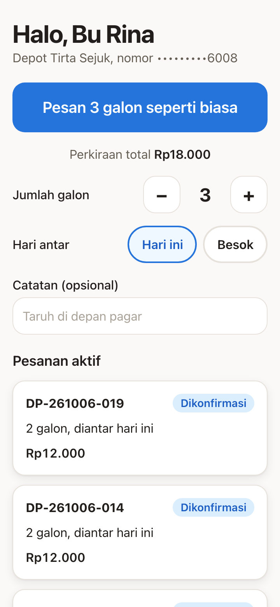
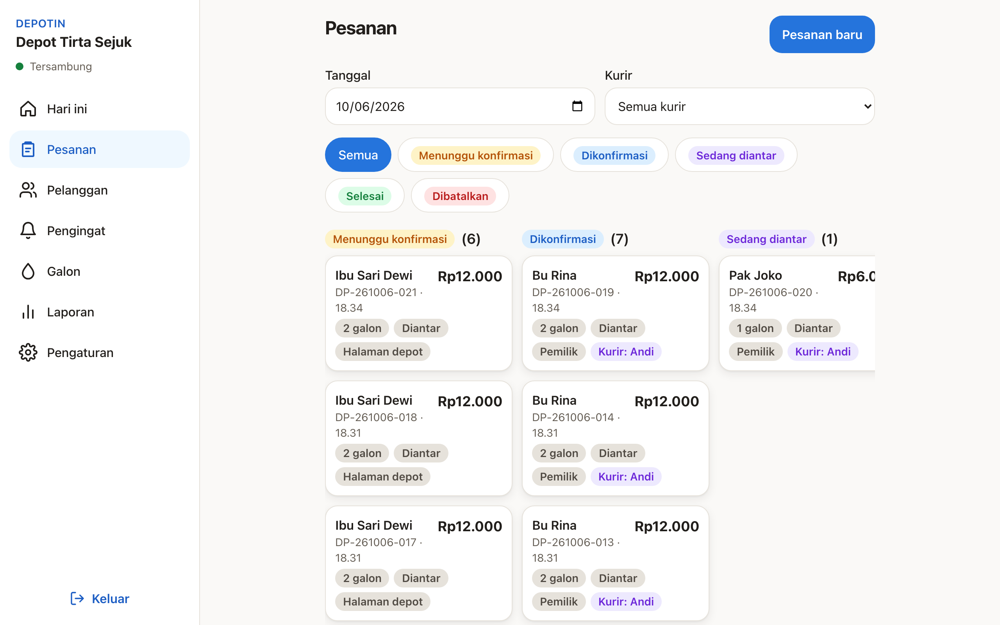
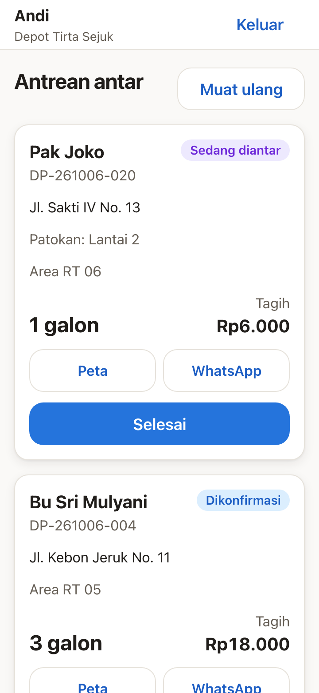

# Depotin

Sistem web untuk depot air minum isi ulang. Pemilik mengelola pesanan, kurir, dan galon pinjaman dari satu dasbor. Kurir mengantar dari halaman HP dengan tombol besar. Pelanggan memesan ulang lewat satu link pribadi tanpa akun dan tanpa aplikasi.

Fitur pembedanya adalah **prediksi galon habis**: sistem menghitung pola konsumsi tiap pelanggan dari riwayat pengantarannya, lalu menyusun antrean pelanggan yang perlu ditawari hari ini lengkap dengan pesan WhatsApp siap kirim, dan mengukur berapa pengingat yang menjadi pesanan.

Dokumen: [PRD](docs/PRD.md), [spesifikasi teknis](docs/SPEC.md), [arsitektur](docs/ARCHITECTURE.md), [keputusan](docs/DECISIONS.md), [daftar periksa keamanan](docs/SECURITY_CHECKLIST.md), [pustaka pihak ketiga](docs/THIRD_PARTY.md), [bahan proposal](docs/PROPOSAL_NOTES.md), [panduan deploy](deploy/README.md).

## Tangkapan layar

| Pengingat galon hampir habis, satu ketukan kirim WA | Link pribadi pelanggan, pesan ulang tanpa mengetik |
| --- | --- |
|  |  |
| **Papan pesanan pemilik, status berubah langsung lewat SSE** | **Halaman kurir, antrean hari ini dengan tombol Berangkat dan Selesai** |
|  |  |

## Arsitektur singkat

```
Peramban  ──HTTPS satu asal──▶  SvelteKit di Vercel  ──X-Edge-Key──▶  Caddy + API Go di VPS  ──pgx──▶  PostgreSQL di Neon
    └──────────── SSE langsung dengan tiket sekali pakai ─────────────────────▲
```

- API: Go 1.26, Fiber v3, pgx v5, sqlc, goose. Satu proses tanpa Redis. Logika domain (prediksi, mesin status, buku galon, loyalitas, urutan antar) adalah fungsi murni dengan tes tabel.
- Web: SvelteKit 2, Svelte 5 runes, TypeScript strict, Tailwind CSS v4. Halaman publik di-SSR, dasbor pemilik dan kurir di-render di klien.
- Keamanan: Argon2id, JWT 15 menit, token penyegar dirotasi dengan deteksi pemakaian ulang, cookie HttpOnly, isolasi per depot di setiap kueri, CSP mode hash, pembatasan laju, token pelanggan ter-hash dan terenkripsi.

Rincian di [docs/ARCHITECTURE.md](docs/ARCHITECTURE.md).

## Menjalankan lokal

Prasyarat: Go 1.26 (toolchain diunduh otomatis), Node 24, Docker.

```sh
make dev            # PostgreSQL 18 lokal di port 54329
make migrate-up     # skema
make seed           # depot contoh "Depot Tirta Sejuk" dengan riwayat 8 minggu
make api            # API di http://localhost:8080
make web            # web di http://localhost:5173 (jalankan npm install dulu di apps/web)
```

Salin `apps/api/.env.example` ke `apps/api/.env` dan `apps/web/.env.example` ke `apps/web/.env`. Nilai bawaan pengembangan sudah bekerja tanpa mengisi rahasia; isi `DATABASE_URL` dengan string koneksi Neon bila ingin memakai basis data yang sama dengan demo.

## Akun demo

Tampil di halaman masuk saat `PUBLIC_DEMO_MODE=true`.

| Peran | Nomor HP | Kata sandi |
|---|---|---|
| Pemilik | 081200000001 | demo-depotin-2026 |
| Kurir Andi | 081200000002 | demo-depotin-2026 |
| Kurir Budi | 081200000003 | demo-depotin-2026 |

Halaman publik depot contoh: `/d/depot-tirta-sejuk`. Data depot contoh disetel ulang otomatis setiap hari pada `DEMO_RESET_HOUR`.

## Perintah pengembangan

| Perintah | Fungsi |
|---|---|
| `make check` | lint, `sqlc diff`, dan seluruh tes |
| `make test-api` | `go test -race` termasuk tes integrasi terhadap PostgreSQL lokal |
| `make test-web` | Vitest |
| `cd apps/web && npm run test:e2e` | Playwright pada viewport HP dan desktop (API dan web harus berjalan) |
| `make lint` | gofmt, go vet, golangci-lint, svelte-check, ESLint, Prettier |
| `make sqlc` | generate kode Go dari SQL |
| `make types` | generate tipe TypeScript dari `apps/api/openapi.yaml` |

CI di GitHub Actions menjalankan semuanya pada setiap push, termasuk `govulncheck` dan `npm audit`.

## Struktur

```
apps/api     API Go: cmd/{api,migrate,seed}, internal/{auth,order,prediction,...}, db/{migrations,queries,sqlc}
apps/web     SvelteKit: routes/{app,kurir,d,t,p,api}, lib/{api,components,state,stream,utils}
deploy       Dockerfile, docker-compose, Caddyfile, update.sh, README
docs         PRD, SPEC, ARCHITECTURE, DECISIONS, PROGRESS, SECURITY_CHECKLIST, THIRD_PARTY, PROPOSAL_NOTES
```

## Lisensi

MIT. Lihat [LICENSE](LICENSE).
