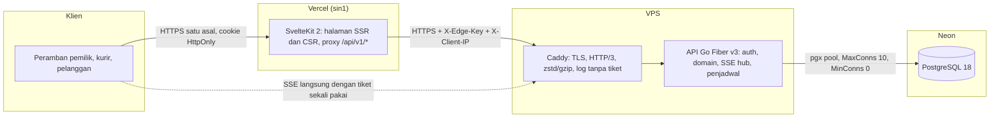
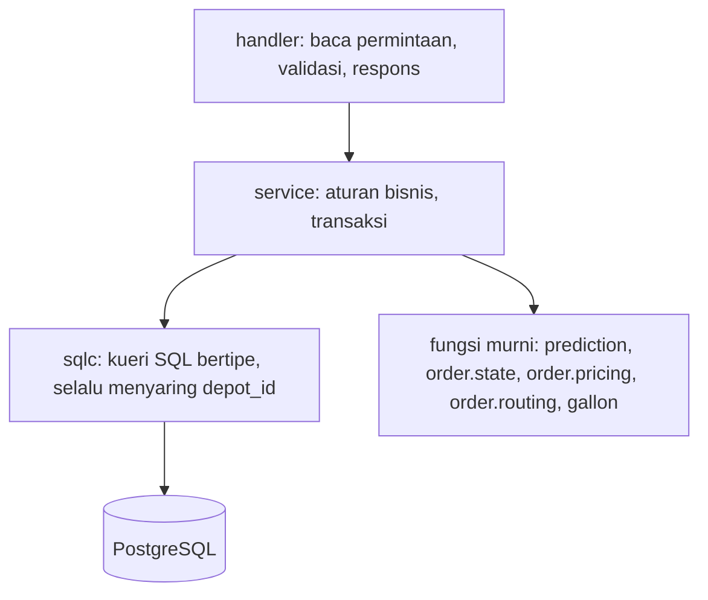
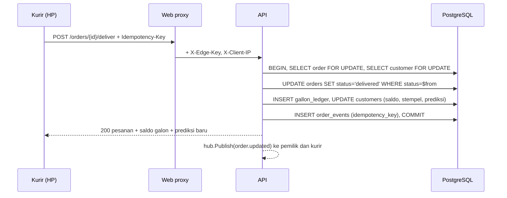
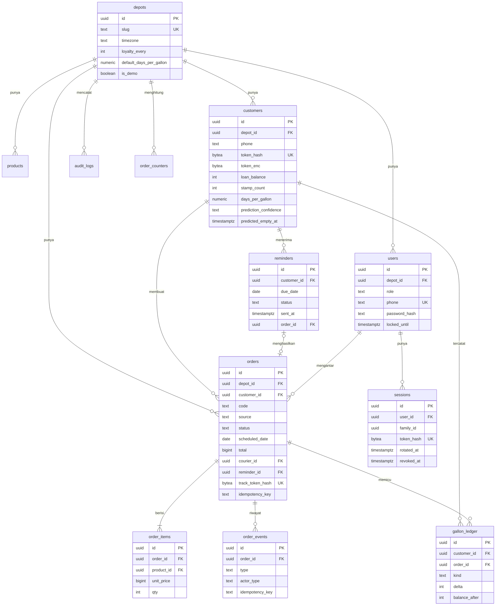
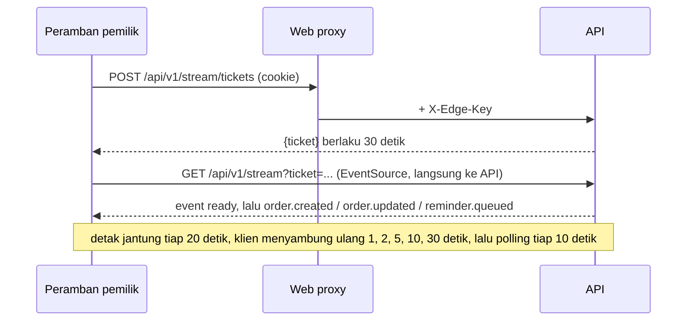

# Arsitektur Depotin

## Gambaran

Peramban hanya berbicara dengan origin web. Proxy di `apps/web/src/routes/api/[...path]/+server.ts` menambahkan `X-Edge-Key`, dan API menolak permintaan tanpa kunci itu kecuali `/healthz` dan `GET /api/v1/stream`.

## Lapisan di API

| Paket | Tanggung jawab |
|---|---|
| `internal/platform/httpx` | respons baku `{data}` dan `{error}`, dekode JSON ketat, validasi, paginasi kursor, middleware request ID, pemulihan, log, edge key, Origin, batas laju |
| `internal/auth` | Argon2id, JWT HS256 15 menit, token penyegar 30 hari dengan rotasi dan deteksi pemakaian ulang, penguncian akun |
| `internal/order` | pembuatan pesanan dengan salinan harga, kode `DP-YYMMDD-NNN`, idempotensi, mesin status, transaksi penyelesaian, urutan antar |
| `internal/prediction` | rata-rata bergerak eksponensial atas jarak antar pengantaran, pembuangan jeda tidak wajar, tingkat keyakinan |
| `internal/reminder` | antrean harian idempoten, kirim WA, lewati, atribusi konversi 48 jam |
| `internal/gallon` | buku galon pinjaman, penyesuaian manual, galon mengendap |
| `internal/public` | halaman depot ber-cache dan ETag, pesanan publik, pelacakan bertoken, halaman pribadi |
| `internal/stream` | hub SSE dalam memori, tiket 30 detik sekali pakai, batas 3 koneksi per pengguna |
| `internal/report` | dasbor hari ini, ringkasan rentang, ekspor CSV, log audit |
| `internal/scheduler` | 06.00 WIB susun antrean pengingat, setel ulang depot demo, penjaga hidup Neon |
| `internal/seed` | depot contoh deterministik dengan riwayat 8 minggu lewat service asli |

## Alur penyelesaian pesanan

Permintaan ulang dengan `Idempotency-Key` yang sama menemukan peristiwa `delivered` dan membalas keadaan terkini tanpa menulis buku galon lagi. Dua permintaan bersamaan dengan kunci berbeda: yang kedua menemukan status sudah `delivered` dan dibalas `409 invalid_transition`.

## Diagram relasi basis data

## Indeks dan kueri utama

| Kueri | Indeks yang dipakai (diperiksa dengan `EXPLAIN` pada data contoh) |
|---|---|
| papan pesanan per status dan tanggal | `orders_board_idx (depot_id, status, scheduled_date)` |
| antrean kurir | `orders_courier_queue_idx (courier_id, status) WHERE status IN ('confirmed','on_delivery')` |
| antrean pengingat | `customers_reminder_idx (depot_id, predicted_empty_at) WHERE is_active AND is_verified`, `orders_customer_active_idx`, `reminders_depot_status_due_idx` |
| pencarian pelanggan saat mengetik | indeks GIN trigram pada `name`, `phone`, `address` |
| riwayat dan prediksi | `orders_customer_delivered_idx (customer_id, delivered_at DESC) WHERE status = 'delivered'` |

Pada data contoh (40 pelanggan, sekitar 190 pesanan) perencana memilih pemindaian berurutan karena tabel muat dalam beberapa halaman. Dengan `SET enable_seqscan = off` semua kueri di atas memakai indeks yang dirancang, sehingga pada skala ribuan pesanan perencana akan beralih sendiri.

## Pembaruan langsung

