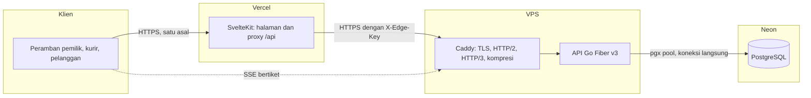
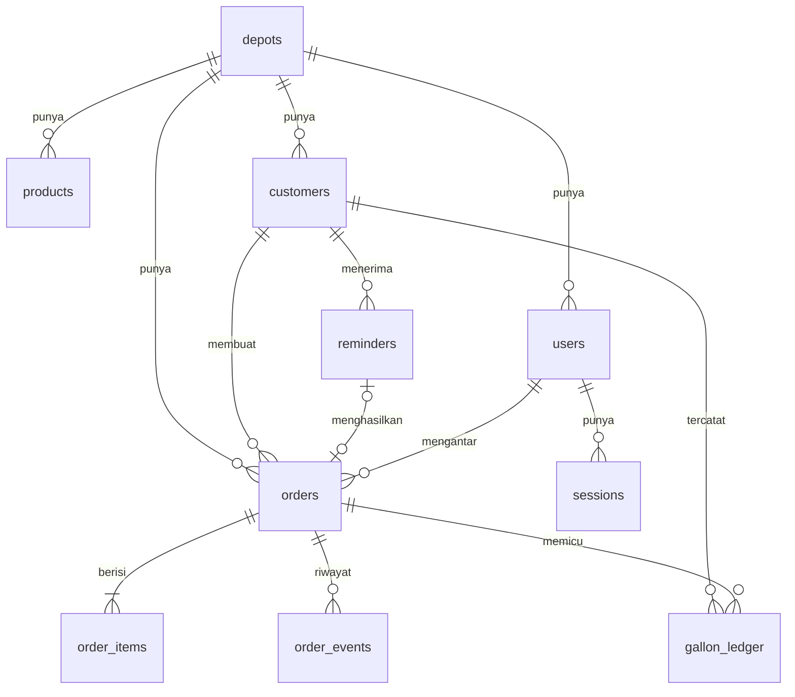
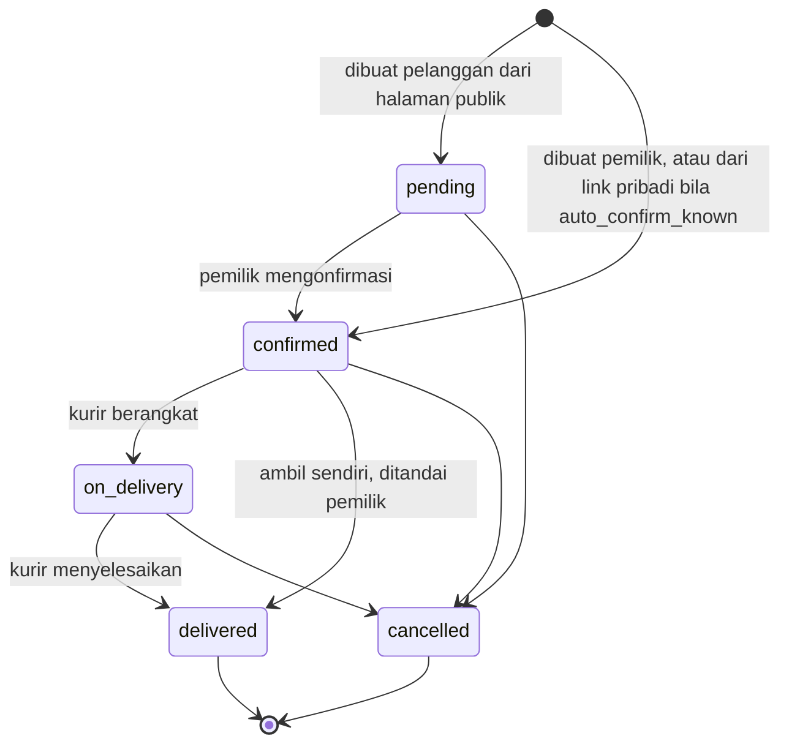

# Depotin: Spesifikasi Teknis

| | |
|---|---|
| Versi | 1.0 |
| Tanggal | 6 Oktober 2026 |
| Dokumen terkait | `PRD.md` (kebutuhan produk), `MASTER_PROMPT.md` (prompt Claude Code) |

Dokumen ini adalah sumber kebenaran teknis. Bila ada pertentangan dengan `PRD.md` soal perilaku produk, `PRD.md` yang berlaku. Bila ada pertentangan soal cara membangun, dokumen ini yang berlaku.

## 1. Prinsip rancangan

1. **Peramban hanya berbicara dengan satu asal.** Semua permintaan API dari peramban lewat origin web. Server API tidak pernah dipanggil langsung oleh peramban, kecuali satu jalur streaming bertiket.
2. **Server tidak percaya klien.** Depot, peran, harga, dan total selalu ditentukan di server.
3. **Logika bisnis adalah fungsi murni.** Prediksi, mesin status, buku galon, dan loyalitas ditulis tanpa ketergantungan pada basis data, sehingga mudah diuji.
4. **SQL ditulis tangan dan diperiksa saat kompilasi.** Tidak ada ORM dan tidak ada penyusunan SQL dari string.
5. **Sederhana untuk dijalankan.** Satu proses API, satu basis data, tanpa Redis, tanpa antrean pesan.
6. **Setiap fitur bisa didemokan.** Data contoh yang realistis adalah bagian dari produk.

## 2. Arsitektur



### 2.1 Komponen

| Komponen | Lokasi | Tanggung jawab |
|---|---|---|
| Web | Vercel, region Singapura (`sin1`) | Halaman, proxy `/api/*`, header keamanan |
| Caddy | VPS | TLS otomatis, HTTP/2 dan HTTP/3, kompresi, log akses |
| API | VPS, kontainer Docker | Seluruh logika bisnis, autentikasi, SSE, penjadwal |
| Basis data | Neon, region Singapura bila tersedia | PostgreSQL |

### 2.2 Alur permintaan

1. Peramban memanggil `https://<web>/api/v1/...`.
2. Rute proxy SvelteKit meneruskan ke `https://<api>/api/v1/...` dengan menambahkan `X-Edge-Key` (rahasia bersama) dan `X-Client-IP` (alamat klien asli).
3. API menolak semua permintaan tanpa `X-Edge-Key` yang benar, kecuali `GET /healthz` dan `GET /api/v1/stream`.
4. Cookie sesi dipasang oleh API dan diteruskan apa adanya oleh proxy, sehingga menjadi cookie pihak pertama di origin web.

Alasan memakai proxy, bukan pemanggilan lintas asal: domain `vercel.app` dan subdomain gratis VPS adalah dua situs berbeda, sehingga cookie lintas situs akan diblokir peramban. Proxy membuat semuanya satu asal, menghilangkan CORS, dan memungkinkan API menolak lalu lintas langsung.

### 2.3 Jalur streaming

Koneksi SSE berumur panjang tidak dilewatkan proxy supaya tidak membebani fungsi Vercel. Peramban meminta tiket sekali pakai lewat proxy (`POST /api/v1/stream/tickets`), lalu membuka `EventSource` langsung ke `https://<api>/api/v1/stream?ticket=...`. Rincian di bagian 8.

## 3. Teknologi dan alasan pemilihan

Tabel ini bisa disalin ke proposal.

| Lapisan | Pilihan | Alasan |
|---|---|---|
| Bahasa API | Go (versi stabil terbaru, minimal 1.25) | Biner tunggal, konsumsi memori kecil, konkurensi bawaan untuk SSE |
| Kerangka HTTP | Fiber v3 | Dibangun di atas fasthttp, alokasi memori rendah, middleware SSE bawaan |
| Driver basis data | pgx v5 dengan pgxpool | Driver PostgreSQL native tercepat di Go, cache prepared statement otomatis |
| Akses data | sqlc | Kode Go bertipe aman dihasilkan dari SQL, diperiksa saat kompilasi, tanpa refleksi |
| Migrasi | goose | Migrasi SQL berurutan, bisa disematkan ke biner |
| Basis data | PostgreSQL di Neon | Terkelola, cadangan otomatis, gratis untuk skala lomba |
| Kata sandi | Argon2id | Rekomendasi OWASP, tahan serangan GPU |
| Token akses | JWT HS256 berumur 15 menit | Tanpa kueri basis data per permintaan |
| Token penyegar | Acak 256 bit, disimpan sebagai hash, dirotasi | Bisa dicabut, mendeteksi pemakaian ulang |
| Validasi | go-playground/validator v10 | Deklaratif di struct |
| Log | log/slog format JSON | Bawaan Go, terstruktur |
| Frontend | SvelteKit 2 dengan Svelte 5 (runes) dan TypeScript | Bundel kecil, tanpa virtual DOM, cocok untuk HP kelas bawah |
| Gaya | Tailwind CSS v4 | Konsisten, CSS akhir kecil |
| Tipe API di frontend | openapi-typescript | Tipe dihasilkan dari `openapi.yaml`, klien dan server tidak bisa menyimpang |
| Proxy balik | Caddy | HTTPS otomatis, HTTP/3, konfigurasi ringkas |
| Kontainer | Docker, citra distroless | Permukaan serangan kecil, berjalan sebagai pengguna non-root |
| Tes | go test, Vitest, Playwright | Unit, integrasi, dan ujung ke ujung |
| CI | GitHub Actions | Lint, tes, pemindaian kerentanan di setiap push |

Aturan versi: pakai versi stabil terbaru saat proyek dibuat, lalu kunci di `go.mod` dan `package.json`. API Fiber v3 berbeda dari v2 (misalnya handler menerima `fiber.Ctx`, bukan `*fiber.Ctx`), jadi rujuk dokumentasi resmi v3.

## 4. Struktur repositori

```
depotin/
  apps/
    api/
      cmd/
        api/            main.go: susun dependensi, jalankan server
        migrate/        main.go: jalankan migrasi goose
        seed/           main.go: isi data contoh
      internal/
        config/         baca dan validasi variabel lingkungan
        platform/
          db/           pgxpool, transaksi, penanganan galat
          httpx/        respons, galat, paginasi, pengikatan dan validasi
          clock/        antarmuka waktu agar bisa dipalsukan saat tes
          idgen/        UUIDv7, kode pesanan, token acak
          crypto/       argon2id, hash token, perbandingan waktu tetap
          ratelimit/    pembatas laju dalam memori
          cache/        cache TTL dalam memori
        auth/           handler, service, token, middleware
        depot/
        user/
        product/
        customer/
        order/
        gallon/
        prediction/     fungsi murni
        reminder/
        report/
        public/         endpoint tanpa login
        stream/         hub SSE dan tiket
        scheduler/      tugas berkala
        audit/
      db/
        migrations/     berkas goose
        queries/        berkas SQL untuk sqlc
        sqlc/           hasil generate, tidak diedit tangan
      openapi.yaml
      sqlc.yaml
      Dockerfile
    web/
      src/
        routes/
          +layout.svelte
          +page.svelte                 beranda
          masuk/
          daftar/
          d/[slug]/                    halaman publik depot
          t/[token]/                   pelacakan satu pesanan
          p/[token]/                   halaman pribadi pelanggan
          app/                         dasbor pemilik
          kurir/                       halaman kurir
          api/[...path]/+server.ts     proxy
        lib/
          api/                         klien fetch, tipe hasil generate
          components/                  komponen antarmuka
          state/                       state berbasis runes (.svelte.ts)
          utils/                       rupiah, tanggal, nomor HP, link WhatsApp
          stream/                      klien SSE dengan cadangan polling
        hooks.server.ts
        app.css
      static/
      tests/                           Playwright
      svelte.config.js
      vite.config.ts
  deploy/
    docker-compose.yml
    Caddyfile
    update.sh
    README.md
  docs/
    PRD.md
    SPEC.md
    ARCHITECTURE.md
    MASTER_PROMPT.md
    PROGRESS.md
    DECISIONS.md
    THIRD_PARTY.md
    SECURITY_CHECKLIST.md
    PROPOSAL_NOTES.md
  .github/workflows/ci.yml
  docker-compose.dev.yml               PostgreSQL lokal
  Makefile                             dev, check, test, lint, migrate, sqlc, seed, types
  README.md
  LICENSE
```

### 4.1 Lapisan di dalam tiap modul API

```
handler   membaca permintaan, memvalidasi, memanggil service, menulis respons
service   aturan bisnis, transaksi, memanggil repository dan fungsi murni
repository  pembungkus tipis di atas kode sqlc
```

Aturan ketergantungan: handler boleh mengenal service, service boleh mengenal repository. Arah sebaliknya dilarang. Modul lain diakses lewat antarmuka kecil yang didefinisikan oleh pemakainya.

## 5. Model data

### 5.1 Konvensi

- Kunci utama `id uuid`, dibuat di aplikasi sebagai UUIDv7 agar terurut waktu dan ramah indeks.
- Uang disimpan sebagai `bigint` dalam Rupiah utuh.
- Waktu disimpan sebagai `timestamptz` dalam UTC. Tanggal bisnis (`date`) dihitung dalam zona waktu depot.
- Nilai terbatas disimpan sebagai `text` dengan `CHECK`, bukan tipe enum PostgreSQL, supaya migrasi sederhana.
- Semua tabel bisnis punya `depot_id` dan semua kueri menyaringnya.
- Nomor HP disimpan dalam bentuk angka berawalan `62`.

### 5.2 Diagram relasi



### 5.3 Tabel

**depots**

| Kolom | Tipe | Keterangan |
|---|---|---|
| id | uuid PK | |
| name | text | 3 sampai 80 karakter |
| slug | text unik | huruf kecil, angka, tanda hubung |
| phone | text | nomor WhatsApp depot |
| address | text | |
| lat, lng | double precision null | titik awal rute |
| timezone | text | bawaan `Asia/Jakarta` |
| open_time, close_time | time | |
| delivery_fee | bigint | bawaan 0 |
| is_accepting_orders | boolean | bawaan true |
| auto_confirm_known | boolean | bawaan true. Pesanan dari link pribadi langsung dikonfirmasi |
| loyalty_every | int null | null berarti loyalitas mati |
| reminder_lead_days | int | bawaan 1 |
| default_days_per_gallon | numeric(5,2) | bawaan 4.00 |
| is_demo | boolean | bawaan false |
| created_at, updated_at | timestamptz | |

**users**

| Kolom | Tipe | Keterangan |
|---|---|---|
| id | uuid PK | |
| depot_id | uuid FK | |
| role | text | `owner` atau `courier` |
| name | text | |
| phone | text unik | dipakai untuk masuk |
| password_hash | text | format PHC Argon2id |
| is_active | boolean | |
| failed_login_count | int | |
| locked_until | timestamptz null | |
| last_login_at | timestamptz null | |
| created_at, updated_at | timestamptz | |

**sessions** (token penyegar)

| Kolom | Tipe | Keterangan |
|---|---|---|
| id | uuid PK | |
| user_id | uuid FK | |
| family_id | uuid | satu keluarga per login |
| token_hash | bytea unik | SHA-256 dari token |
| expires_at | timestamptz | |
| rotated_at | timestamptz null | terisi saat sudah ditukar |
| revoked_at | timestamptz null | |
| user_agent | text | dipotong 200 karakter |
| ip | inet | |
| created_at | timestamptz | |

**products**

| Kolom | Tipe | Keterangan |
|---|---|---|
| id | uuid PK | |
| depot_id | uuid FK | |
| name | text | unik per depot |
| kind | text | `refill`, `new_gallon`, `other` |
| price | bigint | lebih dari atau sama dengan 0 |
| is_active | boolean | |
| sort_order | int | |
| created_at, updated_at | timestamptz | |

**customers**

| Kolom | Tipe | Keterangan |
|---|---|---|
| id | uuid PK | |
| depot_id | uuid FK | |
| name | text | |
| phone | text | unik per depot |
| address | text | |
| address_note | text | patokan |
| area | text | label bebas, misalnya RT 03 |
| lat, lng | double precision null | |
| token_hash | bytea unik null | SHA-256 token link pribadi, dipakai untuk pencarian |
| token_enc | bytea null | token terenkripsi AES-256-GCM, dipakai untuk membentuk ulang link |
| token_rotated_at | timestamptz null | |
| source | text | `owner` atau `public` |
| is_verified | boolean | true setelah dibuat pemilik atau pesanan pertamanya selesai |
| usual_qty | int | bawaan 1 |
| loan_balance | int | galon depot yang dipegang pelanggan, minimal 0 |
| stamp_count | int | bawaan 0, minimal 0 |
| days_per_gallon | numeric(6,2) null | |
| prediction_samples | int | |
| prediction_confidence | text | `none`, `low`, `medium`, `high` |
| last_delivered_at | timestamptz null | |
| last_delivered_qty | int null | |
| predicted_empty_at | timestamptz null | |
| reminder_snoozed_until | date null | |
| is_active | boolean | |
| created_at, updated_at | timestamptz | |

**orders**

| Kolom | Tipe | Keterangan |
|---|---|---|
| id | uuid PK | |
| depot_id | uuid FK | |
| customer_id | uuid FK | |
| code | text | unik per depot, format `DP-YYMMDD-NNN` |
| source | text | `public`, `link`, `reminder`, `owner`, `courier` |
| status | text | `pending`, `confirmed`, `on_delivery`, `delivered`, `cancelled` |
| fulfilment | text | `delivery` atau `pickup` |
| scheduled_date | date | |
| delivery_name, delivery_phone, delivery_address, delivery_note | text | salinan saat pesanan dibuat |
| note | text | |
| refill_qty | int | jumlah galon isi ulang di pesanan |
| free_qty | int | galon gratis dari loyalitas |
| subtotal, delivery_fee, discount, total | bigint | |
| payment_method | text null | `cash`, `transfer`, `qris` |
| payment_status | text | `unpaid` atau `paid` |
| paid_at | timestamptz null | |
| courier_id | uuid FK null | |
| gallons_returned | int null | terisi saat selesai |
| reminder_id | uuid FK null | |
| track_token_hash | bytea unik | hash token pelacakan |
| idempotency_key | text null | unik per depot bila terisi |
| created_by | uuid FK null | null bila dibuat pelanggan |
| created_at, confirmed_at, dispatched_at, delivered_at, cancelled_at | timestamptz | |
| cancel_reason | text null | |

**order_items**

| Kolom | Tipe | Keterangan |
|---|---|---|
| id | uuid PK | |
| order_id | uuid FK | |
| product_id | uuid FK | |
| product_name, product_kind | text | salinan |
| unit_price | bigint | salinan |
| qty | int | 1 sampai 50 |
| line_total | bigint | |

**order_events**

| Kolom | Tipe | Keterangan |
|---|---|---|
| id | uuid PK | |
| depot_id, order_id | uuid FK | |
| type | text | `created`, `confirmed`, `assigned`, `dispatched`, `delivered`, `cancelled`, `paid` |
| actor_type | text | `user`, `customer`, `system` |
| actor_id | uuid null | |
| idempotency_key | text null | unik per pesanan bila terisi, dipakai aksi `dispatch` dan `deliver` |
| meta | jsonb | |
| created_at | timestamptz | |

**gallon_ledger**

| Kolom | Tipe | Keterangan |
|---|---|---|
| id | uuid PK | |
| depot_id, customer_id | uuid FK | |
| order_id | uuid FK null | |
| kind | text | `delivery`, `adjustment`, `lost` |
| delta | int | bisa positif atau negatif |
| balance_after | int | minimal 0 |
| note | text | wajib untuk `adjustment` dan `lost` |
| created_by | uuid FK null | |
| created_at | timestamptz | |

**reminders**

| Kolom | Tipe | Keterangan |
|---|---|---|
| id | uuid PK | |
| depot_id, customer_id | uuid FK | |
| due_date | date | unik bersama customer_id |
| predicted_empty_at | timestamptz | |
| status | text | `queued`, `sent`, `ordered`, `skipped`, `expired` |
| sent_at | timestamptz null | |
| sent_by | uuid FK null | |
| order_id | uuid FK null | |
| created_at | timestamptz | |

**order_counters**: `(depot_id, day date, last_no int)`, kunci utama gabungan `(depot_id, day)`.

**audit_logs**: `id, depot_id, user_id null, action, entity_type, entity_id, meta jsonb, ip inet, created_at`.

### 5.4 Indeks

| Tabel | Indeks | Dipakai untuk |
|---|---|---|
| orders | `(depot_id, status, scheduled_date)` | papan pesanan dan antrean kurir |
| orders | `(depot_id, created_at desc)` | daftar terbaru |
| orders | `(customer_id, delivered_at desc) where status = 'delivered'` | prediksi dan riwayat |
| orders | `(courier_id, status) where status in ('confirmed','on_delivery')` | antrean kurir |
| customers | `(depot_id, predicted_empty_at) where is_active and is_verified` | antrean pengingat |
| customers | indeks trigram GIN pada `name`, `phone`, `address` | pencarian saat mengetik (ekstensi `pg_trgm`) |
| reminders | `(depot_id, status, due_date)` | halaman pengingat |
| gallon_ledger | `(customer_id, created_at desc)` | buku galon |
| sessions | `(user_id) where revoked_at is null` | keluar dari semua perangkat |
| audit_logs | `(depot_id, created_at desc)` | log aktivitas |

### 5.5 Peran basis data

- `depotin_migrator`: pemilik skema, hanya dipakai `cmd/migrate`.
- `depotin_app`: hanya `SELECT, INSERT, UPDATE, DELETE` pada tabel, dipakai API.

## 6. Aturan domain

### 6.1 Mesin status pesanan



Aturan:

- Perpindahan di luar diagram menghasilkan galat `409 invalid_transition`.
- Pembaruan status memakai `UPDATE ... WHERE id = $1 AND depot_id = $2 AND status = $3`. Bila nol baris terpengaruh, kembalikan `409`. Ini mencegah dua aksi bersamaan.
- Pelanggan hanya boleh membatalkan pesanan `pending` miliknya.
- Kurir hanya boleh mengubah pesanan yang ditugaskan kepadanya.
- Aksi `dispatch` dan `deliver` aman diulang. Permintaan ulang dengan `Idempotency-Key` yang sama mengembalikan `200` berisi keadaan pesanan terkini tanpa menjalankan efeknya lagi. Permintaan dengan kunci berbeda pada pesanan yang sudah berpindah status tetap dibalas `409`.

### 6.2 Penyelesaian pesanan

Dijalankan dalam satu transaksi basis data:

1. Kunci baris pelanggan (`SELECT ... FOR UPDATE`).
2. Validasi `gallons_returned <= refill_qty + loan_balance`.
3. Ubah status pesanan menjadi `delivered`, isi `gallons_returned`, `delivered_at`, dan data pembayaran.
4. Hitung `delta = refill_qty - gallons_returned`. Bila `delta != 0`, tulis `gallon_ledger` dan perbarui `loan_balance`.
5. Perbarui stempel loyalitas (bagian 6.4).
6. Hitung ulang prediksi (bagian 6.5), lalu simpan ke `customers`.
7. Tandai `is_verified = true` pada pelanggan.
8. Tulis `order_events`.

Setelah transaksi berhasil, terbitkan peristiwa SSE.

### 6.3 Kode pesanan

`DP-YYMMDD-NNN`, dengan tanggal dalam zona waktu depot dan `NNN` nomor urut harian. Nomor urut diambil dengan satu pernyataan:

```sql
INSERT INTO order_counters (depot_id, day, last_no) VALUES ($1, $2, 1)
ON CONFLICT (depot_id, day) DO UPDATE SET last_no = order_counters.last_no + 1
RETURNING last_no;
```

### 6.4 Loyalitas

Hanya aktif bila `depots.loyalty_every` terisi (misalnya 10).

- Saat pesanan dibuat: `free_qty = 1` bila `stamp_count >= loyalty_every`, `refill_qty >= 1`, dan pelanggan tidak punya pesanan aktif lain dengan `free_qty > 0`. Selain itu 0. `discount = free_qty * harga isi ulang`.
- Saat pesanan selesai: `stamp_count = stamp_count + (refill_qty - free_qty) - free_qty * loyalty_every`.
- Saat pesanan dibatalkan: tidak ada perubahan, karena stempel baru berubah saat selesai.

### 6.5 Prediksi galon habis

Fungsi murni di paket `prediction`.

**Masukan**: daftar pengantaran selesai milik satu pelanggan yang `refill_qty > 0`, terurut waktu, maksimal 7 terakhir. Tiap butir berisi `delivered_at` dan `refill_qty`. Ditambah `default_days_per_gallon` depot.

**Langkah**:

1. Untuk tiap pasangan pengantaran berurutan `i` dan `i+1`:
   `sample_i = selisih_hari(delivered_at[i+1], delivered_at[i]) / refill_qty[i]`.
   Selisih hari berupa pecahan, minimal 0,25.
2. Bila jumlah sampel `n >= 4`, hitung median lalu buang sampel yang lebih besar dari `3 x median` atau lebih kecil dari `median / 3`.
3. Hitung rata-rata bergerak eksponensial atas sampel tersisa secara kronologis dengan `alpha = 0,4`, dimulai dari sampel tertua.
4. Susutkan ke angka bawaan depot: `estimate = (n * ewma + 1 * default) / (n + 1)`.
5. Batasi `days_per_gallon` ke rentang 0,5 sampai 30.
6. `predicted_empty_at = last_delivered_at + last_delivered_qty * days_per_gallon`.

**Tingkat keyakinan**:

| Kondisi | Keyakinan |
|---|---|
| Belum ada pengantaran selesai | `none`, tanpa prediksi |
| 0 atau 1 sampel | `low` |
| 2 atau 3 sampel | `medium` |
| 4 sampel atau lebih dengan koefisien variasi maksimal 0,35 | `high` |
| 4 sampel atau lebih dengan koefisien variasi di atas 0,35 | `medium` |

**Penjelasan untuk pengguna**: fungsi juga mengembalikan teks seperti "Biasanya 1 galon habis dalam 3,5 hari, dihitung dari 6 pesanan terakhir".

**Kasus uji wajib**: tanpa riwayat, satu pengantaran, pola stabil, satu jeda panjang di tengah (pelanggan mudik), jumlah galon berubah, dua pengantaran di hari yang sama.

### 6.6 Antrean pengingat

Dijalankan penjadwal tiap hari pukul 06.00 zona waktu depot, dan dijalankan ulang secara idempoten saat halaman Pengingat dibuka.

Seorang pelanggan masuk antrean hari ini bila semua syarat terpenuhi:

1. `is_active` dan `is_verified`.
2. `predicted_empty_at` tidak null dan `tanggal(predicted_empty_at) - reminder_lead_days <= hari ini`.
3. Tidak punya pesanan berstatus `pending`, `confirmed`, atau `on_delivery`.
4. `reminder_snoozed_until` null atau sudah lewat.
5. Tidak punya pengingat berstatus `queued` atau `sent` dalam 3 hari terakhir.

Penyisipan memakai `ON CONFLICT (customer_id, due_date) DO NOTHING`, sehingga pengingat yang sudah dilewati tidak muncul lagi di hari yang sama. Pengingat `queued` yang berumur lebih dari 3 hari diubah menjadi `expired`.

**Kirim**: `POST /reminders/{id}/send` mengubah status menjadi `sent` dan mengembalikan `wa_url` berbentuk `https://wa.me/<nomor>?text=<pesan ter-encode>`. Templat pesan:

```
Halo {nama}, ini {depot}. Perkiraan kami air galon di rumah hampir habis. Mau diantar hari ini? Pesan sekali ketuk di sini: {link}
```

`{link}` adalah link pribadi pelanggan dengan parameter `?r={id pengingat}`. Bila pelanggan belum punya token, sistem membuatnya saat itu. Bila sudah punya, link dibentuk ulang dari token terenkripsi di kolom `token_enc` (bagian 10.6), tanpa merotasinya.

**Konversi**: parameter `r` sah bila pengingat itu milik pelanggan pemegang token, berstatus `sent`, dan dikirim paling lama 48 jam sebelumnya. Pesanan yang dibuat dengan `r` yang sah mendapat `source = 'reminder'` dan `reminder_id`, dan dalam transaksi yang sama pengingatnya berubah menjadi `ordered` dengan `order_id` terisi. Bila pesanan itu dibatalkan, pengingat kembali menjadi `sent`. Bila `r` tidak sah, pesanan tetap dibuat dengan `source = 'link'`. Konversi dihitung sebagai jumlah pengingat `ordered` dibagi jumlah pengingat `sent` ditambah `ordered`.

### 6.7 Pelanggan berisiko dan perkiraan permintaan

- **Berisiko pindah**: `now > last_delivered_at + 2 * last_delivered_qty * days_per_gallon` dan tidak ada pesanan aktif.
- **Perkiraan pesanan hari ini**: jumlah `usual_qty` dari pelanggan yang `predicted_empty_at` jatuh hari ini atau sudah lewat dan belum memesan.
- **Galon mengendap**: `loan_balance > 0` dan `last_delivered_at` lebih dari 30 hari lalu.

### 6.8 Urutan antar

Untuk antrean satu kurir pada satu hari:

1. Pesanan `on_delivery` selalu di atas.
2. Pesanan dengan koordinat diurutkan dengan heuristik tetangga terdekat, berawal dari koordinat depot, memakai jarak Haversine.
3. Pesanan tanpa koordinat ditaruh setelahnya, dikelompokkan per `area`, lalu per waktu dibuat.

Bila depot tidak punya koordinat, semua pesanan diurutkan per `area` lalu waktu dibuat.

### 6.9 Pesanan dari halaman publik

1. Normalkan nomor HP.
2. Cari pelanggan berdasarkan `(depot_id, phone)`. Bila tidak ada, buat dengan `source = 'public'` dan `is_verified = false`.
3. Buat pesanan `pending` dengan salinan nama, nomor, dan alamat dari formulir. Data pelanggan yang sudah ada tidak diubah dan tidak ditampilkan ke pengirim.
4. Kembalikan hanya kode pesanan dan token pelacakan.

Batas: maksimal 3 pesanan `pending` per nomor HP per depot.

## 7. API

### 7.1 Konvensi

- Awalan `/api/v1`. JSON dengan nama kolom `snake_case`.
- Respons berhasil: `{ "data": ... }` atau `{ "data": [...], "meta": { "next_cursor": "..." } }`.
- Respons galat:

```json
{
  "error": {
    "code": "validation_failed",
    "message": "Data yang dikirim belum lengkap.",
    "fields": { "phone": "Nomor HP tidak valid." }
  }
}
```

- Kode galat baku: `validation_failed` (422), `unauthenticated` (401), `forbidden` (403), `not_found` (404), `conflict` (409), `invalid_transition` (409), `rate_limited` (429), `internal` (500).
- Pesan galat untuk pengguna berbahasa Indonesia. Rincian teknis hanya masuk log.
- Paginasi berbasis kursor untuk daftar yang bisa tumbuh (pesanan, pelanggan, buku galon). `limit` bawaan 25, maksimal 100.
- Semua `POST` pembuat pesanan, serta aksi `dispatch` dan `deliver`, menerima header `Idempotency-Key`.
- Dekode JSON menolak kolom tak dikenal. Batas ukuran badan permintaan 64 KB.
- `depot_id` dan `role` selalu diambil dari token, tidak pernah dari permintaan.

### 7.2 Daftar endpoint

**Kesehatan**

| Metode | Jalur | Akses | Keterangan |
|---|---|---|---|
| GET | `/healthz` | publik | tidak menyentuh basis data |
| GET | `/api/v1/readyz` | edge key | memeriksa basis data |

**Autentikasi**

| Metode | Jalur | Akses |
|---|---|---|
| POST | `/auth/register` | publik |
| POST | `/auth/login` | publik |
| POST | `/auth/refresh` | cookie penyegar |
| POST | `/auth/logout` | login |
| POST | `/auth/logout-all` | login |
| GET | `/auth/me` | login |
| POST | `/auth/password` | login |

**Depot, pengguna, produk** (pemilik)

| Metode | Jalur |
|---|---|
| GET, PATCH | `/depot` |
| GET, POST | `/users` |
| PATCH | `/users/{id}` |
| POST | `/users/{id}/reset-password` |
| GET, POST | `/products` |
| PATCH | `/products/{id}` |

**Pelanggan** (pemilik)

| Metode | Jalur | Keterangan |
|---|---|---|
| GET | `/customers` | parameter `q`, `filter` (`all`, `due`, `at_risk`, `loan`), `cursor` |
| POST | `/customers` | |
| GET, PATCH | `/customers/{id}` | |
| GET | `/customers/{id}/orders` | |
| GET | `/customers/{id}/ledger` | |
| POST | `/customers/{id}/ledger-adjustments` | |
| POST | `/customers/{id}/link` | mengembalikan link pribadi dan `wa_url` |
| POST | `/customers/{id}/link/rotate` | membuat token baru |
| POST | `/customers/{id}/snooze` | menunda pengingat |

**Pesanan**

| Metode | Jalur | Akses | Keterangan |
|---|---|---|---|
| GET | `/orders` | pemilik | parameter `status`, `date`, `courier_id`, `cursor` |
| POST | `/orders` | pemilik | |
| GET | `/orders/{id}` | pemilik, kurir yang ditugaskan | |
| POST | `/orders/{id}/confirm` | pemilik | |
| POST | `/orders/{id}/assign` | pemilik | isi `courier_id` |
| POST | `/orders/{id}/dispatch` | kurir, pemilik | |
| POST | `/orders/{id}/deliver` | kurir, pemilik | isi `gallons_returned`, `payment_method`, `paid` |
| POST | `/orders/{id}/cancel` | pemilik | isi `reason` |
| POST | `/orders/{id}/mark-paid` | pemilik | |

**Kurir**

| Metode | Jalur | Keterangan |
|---|---|---|
| GET | `/courier/queue` | antrean terurut milik kurir yang login |
| POST | `/courier/customers/{id}/location` | simpan `lat`, `lng` |

**Pengingat, galon, dasbor, laporan** (pemilik)

| Metode | Jalur |
|---|---|
| GET | `/reminders` |
| POST | `/reminders/{id}/send` |
| POST | `/reminders/{id}/skip` |
| GET | `/gallons/summary` |
| GET | `/dashboard/today` |
| GET | `/reports/summary` |
| GET | `/reports/export.csv` |

`/gallons/summary` mengembalikan total galon yang sedang dipinjam dan daftar galon mengendap (bagian 6.7).

**Streaming**

| Metode | Jalur | Akses |
|---|---|---|
| POST | `/stream/tickets` | login |
| GET | `/stream` | tiket di kueri, tanpa edge key |

**Publik** (tanpa login, lewat proxy)

| Metode | Jalur | Keterangan |
|---|---|---|
| GET | `/public/depots/{slug}` | info depot, produk, status buka |
| POST | `/public/depots/{slug}/orders` | pesanan baru |
| GET | `/public/track/{token}` | satu pesanan |
| POST | `/public/track/{token}/cancel` | hanya bila `pending` |
| GET | `/public/me/{token}` | halaman pribadi: ringkasan, pesanan aktif, 5 riwayat terakhir |
| POST | `/public/me/{token}/orders` | pesan ulang, parameter opsional `r` |

### 7.3 Contoh: menyelesaikan pesanan

Permintaan `POST /api/v1/orders/{id}/deliver`:

```json
{ "gallons_returned": 2, "payment_method": "cash", "paid": true }
```

Respons `200`:

```json
{
  "data": {
    "id": "0192f3a1-...",
    "code": "DP-261020-014",
    "status": "delivered",
    "total": 12000,
    "payment_status": "paid",
    "customer": {
      "id": "0192f1c7-...",
      "loan_balance": 2,
      "stamp_count": 7,
      "predicted_empty_at": "2026-10-27T03:00:00Z",
      "prediction_confidence": "high"
    }
  }
}
```

### 7.4 Dokumentasi API

`apps/api/openapi.yaml` ditulis tangan dan menjadi sumber tipe TypeScript di frontend. CI gagal bila tipe hasil generate tidak sama dengan yang tersimpan.

## 8. Pembaruan langsung

### 8.1 Hub

- Satu hub dalam proses, berisi peta `depot_id` ke kumpulan klien.
- Tiap klien punya kanal ber-buffer 16. Klien yang penuh diputus.
- Detak jantung tiap 20 detik berupa komentar SSE.
- Karena hub ada di memori, API dijalankan sebagai satu proses tanpa prefork.

### 8.2 Tiket

- `POST /stream/tickets` mengembalikan tiket acak 256 bit yang berlaku 30 detik dan sekali pakai, terikat pada `user_id`, `depot_id`, dan `role`.
- Tiket disimpan di memori dengan kedaluwarsa otomatis.
- `GET /stream?ticket=...` memvalidasi dan menghapus tiket, lalu membuka aliran. Jalur ini mengizinkan CORS hanya untuk origin web.
- Batas 3 koneksi serentak per pengguna dan pembatas laju per alamat IP.

### 8.3 Peristiwa

| Peristiwa | Isi | Penerima |
|---|---|---|
| `order.created` | ringkasan pesanan | pemilik |
| `order.updated` | id, status, kurir | pemilik, kurir yang ditugaskan |
| `reminder.queued` | jumlah antrean | pemilik |

Peristiwa hanya membawa ringkasan. Klien mengambil rincian lewat API biasa.

### 8.4 Klien

- Pembungkus `lib/stream` meminta tiket, membuka `EventSource`, dan saat galat menutup lalu menyambung ulang dengan tiket baru. Jeda ulang 1, 2, 5, 10, lalu 30 detik.
- Setelah 3 kegagalan berturut-turut, klien beralih ke polling `GET /orders` tiap 10 detik sambil tetap mencoba SSE tiap 60 detik.
- Indikator koneksi tampil di dasbor: tersambung, menyambung ulang, atau mode berkala.
- Halaman pelanggan tidak memakai SSE. Halaman itu melakukan polling tiap 15 detik hanya selama ada pesanan aktif dan tab terlihat.

## 9. Frontend

### 9.1 Rute dan cara render

| Rute | Render | Cache | Catatan |
|---|---|---|---|
| `/` | prerender | CDN | beranda produk |
| `/masuk`, `/daftar` | prerender | CDN | formulir sisi klien |
| `/d/[slug]` | SSR | `s-maxage=60, stale-while-revalidate=300` | halaman publik depot |
| `/t/[token]` | SSR | `no-store` | pelacakan, `noindex`, `Referrer-Policy: no-referrer` |
| `/p/[token]` | SSR | `no-store` | halaman pribadi, `noindex`, `Referrer-Policy: no-referrer` |
| `/app/**` | CSR (`ssr = false`) | | dasbor pemilik |
| `/kurir/**` | CSR (`ssr = false`) | | halaman kurir |
| `/api/[...path]` | fungsi server | | proxy |

Fungsi SSR memanggil API dari server ke server dengan `X-Edge-Key` dan `X-Client-IP`, supaya pembatasan laju tetap dihitung per pengunjung.

### 9.2 Proxy

`src/routes/api/[...path]/+server.ts`:

- Meneruskan metode, kueri, badan, dan header yang diizinkan (`content-type`, `cookie`, `idempotency-key`, `origin`, `user-agent`, `accept`).
- Menambahkan `X-Edge-Key` dari variabel lingkungan privat dan `X-Client-IP` dari `event.getClientAddress()`.
- Meneruskan status, badan, dan `Set-Cookie` dari API tanpa mengubahnya.
- Batas waktu 15 detik. Bila API tidak terjangkau, kembalikan `502` dengan badan galat baku.
- Menolak jalur di luar `/api/v1/` dan menolak `GET /api/v1/stream`, karena aliran SSE dibuka langsung ke API.

### 9.3 Halaman pemilik (`/app`)

| Halaman | Isi utama |
|---|---|
| Hari ini | kartu angka, pesanan menunggu konfirmasi, antrean antar, pintasan ke pengingat |
| Pesanan | papan per status, filter tanggal dan kurir, tombol Pesanan baru |
| Pelanggan | pencarian, filter (semua, jatuh tempo, berisiko, memegang galon), rincian pelanggan |
| Pengingat | antrean hari ini dengan tombol Kirim WA, Lewati, Tunda |
| Galon | total dipinjam, daftar mengendap |
| Laporan | rentang tanggal, ringkasan, ekspor CSV |
| Pengaturan | profil depot, produk dan harga, kurir, loyalitas, pengingat |

### 9.4 Halaman kurir (`/kurir`)

- Satu kolom, tombol tinggi minimal 48 piksel, teks minimal 16 piksel.
- Kartu antar menampilkan nama, alamat, patokan, jumlah galon, total tagihan, tombol Peta, tombol WhatsApp.
- Lembar bawah penyelesaian: penghitung galon kosong (terisi otomatis sama dengan jumlah diantar), tiga tombol cara bayar (Tunai, Transfer, Belum bayar), tombol Selesai.
- Antrean aksi luring: aksi `dispatch` dan `deliver` yang gagal karena jaringan disimpan di IndexedDB bersama `Idempotency-Key`, lalu dikirim ulang saat `online`.

### 9.5 Halaman pelanggan

- `/d/[slug]`: nama depot, jam buka, harga, formulir pesan empat kolom, bidang jebakan tersembunyi untuk bot.
- `/t/[token]`: garis waktu status, total, tombol WhatsApp depot, tombol batal bila masih menunggu.
- `/p/[token]`: sapaan nama, tombol besar "Pesan N galon seperti biasa", pengubah jumlah, pesanan aktif, saldo galon pinjaman, kemajuan stempel, lima pesanan terakhir.

### 9.6 Aturan antarmuka

- Setiap aksi yang mengubah data menampilkan tiga keadaan: sedang memproses (tombol nonaktif dengan indikator), berhasil (toast), gagal (pesan dengan tombol coba lagi).
- Daftar punya keadaan kosong dengan ajakan bertindak, kerangka pemuatan, dan keadaan galat.
- Validasi formulir tampil di samping bidangnya, dalam bahasa Indonesia.
- Konfirmasi hanya untuk aksi yang tidak bisa dibatalkan (batalkan pesanan, rotasi link).
- Warna status konsisten di semua halaman dan selalu disertai teks, tidak hanya warna.
- Dukungan mode terang dan gelap mengikuti preferensi sistem.
- Tidak ada skrip pihak ketiga. Font disajikan sendiri.

### 9.7 State dan data

- State global memakai runes di berkas `.svelte.ts`: sesi, koneksi stream, toast.
- Klien API membungkus `fetch`: menambah `Idempotency-Key` untuk `POST` pembuat pesanan, memetakan galat baku, dan pada `401` mencoba `POST /auth/refresh` sekali lalu mengulang permintaan.
- Tipe permintaan dan respons berasal dari `openapi-typescript`.

## 10. Keamanan

### 10.1 Lapisan jaringan

- Caddy mengelola TLS 1.2 ke atas dengan sertifikat otomatis, HSTS, HTTP/2, dan HTTP/3.
- Firewall VPS hanya membuka port 22, 80, dan 443. SSH memakai kunci, bukan kata sandi.
- API hanya mendengarkan di jaringan Docker internal, tidak dipublikasikan ke host.
- API menolak permintaan tanpa `X-Edge-Key` yang benar (perbandingan waktu tetap), kecuali `/healthz` dan `/api/v1/stream`.
- `X-Client-IP` hanya dipercaya bila `X-Edge-Key` benar. Untuk jalur stream, alamat klien diambil dari Caddy.

### 10.2 Autentikasi

- Kata sandi: Argon2id dengan memori 19 MiB, 2 iterasi, 1 paralel, salt 16 byte, keluaran 32 byte, disimpan dalam format PHC. Minimal 10 karakter, maksimal 128.
- Token akses: JWT HS256, umur 15 menit, klaim `sub`, `did` (depot), `role`, `fid` (keluarga sesi), `iat`, `exp`. Algoritma dikunci saat verifikasi.
- Token penyegar: 32 byte acak, umur 30 hari, disimpan sebagai SHA-256. Setiap penukaran menghasilkan token baru dan menandai yang lama. Pemakaian token yang sudah ditukar mencabut seluruh keluarganya.
- Cookie:

| Nama | Isi | Atribut |
|---|---|---|
| `__Host-dp_at` | token akses | `HttpOnly; Secure; SameSite=Lax; Path=/` |
| `__Secure-dp_rt` | token penyegar | `HttpOnly; Secure; SameSite=Strict; Path=/api/v1/auth` |

- Di lingkungan pengembangan lokal, awalan `__Host-` dan `__Secure-` serta atribut `Secure` dimatikan lewat konfigurasi.
- Percobaan masuk: pembatas laju 5 per menit per pasangan IP dan nomor HP. Setelah 5 kegagalan berturut-turut, akun dikunci 15 menit. Pesan galat tidak membedakan nomor salah dan kata sandi salah. Waktu respons disamakan dengan selalu menjalankan verifikasi hash.

### 10.3 Otorisasi

- Middleware `RequireRole` memeriksa peran dari token.
- Setiap kueri sqlc yang menyentuh data bisnis menerima `depot_id` sebagai parameter wajib.
- Tes integrasi wajib membuktikan pengguna depot A menerima `404` saat mengakses data depot B, untuk setiap jenis sumber daya.
- Kurir hanya menerima kolom yang diperlukan untuk mengantar, tanpa data omzet.

### 10.4 CSRF

- Cookie `SameSite` sebagai lapisan pertama.
- Untuk metode pengubah data, API mewajibkan header `Origin` sama dengan `WEB_ORIGIN` dan `Content-Type: application/json`.

### 10.5 Validasi dan keluaran

- Semua masukan divalidasi di handler: panjang, format, rentang angka. Jumlah galon 1 sampai 50.
- Hanya SQL berparameter lewat sqlc.
- Svelte meloloskan keluaran secara bawaan. Pemakaian `{@html}` dilarang.
- `Content-Security-Policy` diatur lewat `kit.csp` di `svelte.config.js` dengan mode `hash`: `default-src 'self'`, `connect-src 'self' <origin stream>`, `frame-ancestors 'none'`, `base-uri 'self'`, `form-action 'self'`. Mode `hash` dipilih, bukan nonce, karena HTML `/d/[slug]` di-cache di CDN dan nonce yang ikut ter-cache akan terpakai ulang.
- Header lain dipasang di `hooks.server.ts`: `X-Content-Type-Options: nosniff`, `Referrer-Policy: strict-origin-when-cross-origin`, dan `Permissions-Policy` yang hanya mengizinkan `geolocation` untuk diri sendiri.

### 10.6 Token pelanggan

- Token link pribadi dan token pelacakan: 16 byte acak, dikodekan base62.
- Basis data menyimpan SHA-256 token untuk pencarian. Untuk link pribadi, token juga disimpan terenkripsi AES-256-GCM dengan kunci `LINK_ENC_KEY`, supaya pemilik bisa menyalin ulang link tanpa merotasinya.
- Halaman bertoken memakai `Cache-Control: no-store`, `X-Robots-Tag: noindex`, dan `Referrer-Policy: no-referrer`.
- Halaman pribadi menyamarkan nomor HP (hanya 4 digit terakhir) dan tidak menampilkan alamat lengkap.
- Log tidak pernah memuat token. Jalur dicatat sebagai pola rute, bukan URL mentah.
- Rotasi membuat token lama langsung tidak berlaku.

### 10.7 Pembatasan laju

| Jalur | Batas | Kunci |
|---|---|---|
| Semua | 300 per menit | IP |
| `POST /auth/login` | 5 per menit | IP dan nomor HP |
| `POST /auth/register` | 3 per jam | IP |
| `POST /public/depots/{slug}/orders` | 5 per 10 menit | IP, dan 3 per jam per nomor HP |
| `GET /public/me/{token}`, `GET /public/track/{token}` | 60 per menit | IP |
| `POST /stream/tickets` | 20 per menit | pengguna |

Pembatas disimpan di memori dengan jendela geser. Respons `429` menyertakan `Retry-After`.

### 10.8 Rahasia dan rantai pasok

- Semua rahasia berasal dari variabel lingkungan. `.env.example` berisi nama tanpa nilai. `.env` masuk `.gitignore`.
- Aplikasi menolak berjalan di mode produksi bila rahasia kosong atau terlalu pendek.
- CI menjalankan `govulncheck` dan `npm audit --omit=dev`.
- Citra Docker memakai dasar distroless statis, pengguna non-root, sistem berkas hanya baca.

### 10.9 Audit

`audit_logs` mencatat: masuk berhasil dan gagal, perubahan harga, perubahan pengguna, penyesuaian buku galon, rotasi link, pembatalan pesanan, ekspor laporan.

## 11. Performa

### 11.1 Target

| Ukuran | Target |
|---|---|
| p95 API baca (di luar bangun basis data) | di bawah 150 ms |
| p95 API tulis pesanan | di bawah 300 ms |
| LCP `/d/[slug]` dan `/p/[token]` pada 4G lambat | di bawah 2,5 detik |
| JavaScript awal rute `/p/[token]` | maksimal 70 KB terkompresi |
| Skor Lighthouse beranda dan halaman publik | minimal 90 untuk performa, aksesibilitas, praktik terbaik |
| Memori API saat diam | di bawah 60 MB |

### 11.2 API

- `pgxpool`: `MaxConns = 10`, `MinConns = 0`, `MaxConnIdleTime = 3 menit`, `MaxConnLifetime = 30 menit`, `HealthCheckPeriod = 1 menit`, batas waktu sambung 10 detik. `MinConns = 0` dan waktu diam 3 menit membiarkan Neon tidur.
- Koneksi memakai string koneksi langsung Neon (tanpa `-pooler`) karena API sudah memegang pool sendiri dan memakai prepared statement.
- Satu percobaan ulang otomatis untuk kueri baca yang gagal karena koneksi terputus.
- Batas waktu konteks 5 detik per permintaan.
- Tidak ada pola N+1. Daftar pesanan mengambil butir pesanan dengan satu kueri tambahan memakai `ANY($1)`.
- Cache TTL 30 detik dalam memori untuk `GET /public/depots/{slug}`, dihapus saat depot atau produk berubah.
- Enkoder JSON cepat (misalnya `goccy/go-json`) dipasang di konfigurasi Fiber.
- Kompresi dilakukan Caddy (zstd dan gzip), bukan aplikasi.
- `ETag` untuk respons publik yang bisa di-cache.

### 11.3 Basis data

- Semua kueri daftar didukung indeks di bagian 5.4. Periksa dengan `EXPLAIN` untuk kueri papan pesanan, antrean kurir, dan antrean pengingat pada data contoh.
- Prediksi dihitung ulang hanya untuk pelanggan yang pesanannya baru selesai, bukan seluruh pelanggan.
- Laporan memakai agregasi SQL dengan rentang tanggal terindeks.

### 11.4 Frontend

- Beranda dan formulir masuk di-prerender. Dasbor dimuat sebagai cangkang statis.
- Pemisahan kode per rute. Komponen berat (grafik laporan) dimuat malas.
- Font disajikan sendiri dengan `font-display: swap`, hanya subset Latin, maksimal dua ketebalan.
- Gambar memakai ukuran eksplisit dan format modern. Ikon berupa SVG sebaris.
- Pembaruan optimistis untuk aksi kurir dan konfirmasi pesanan, dengan pengembalian bila gagal.

### 11.5 Bangun tidur basis data

Paket gratis Neon menidurkan komputasi setelah 5 menit tanpa aktivitas, dan kuota komputasinya terbatas per bulan. Aturan:

- `/healthz` tidak menyentuh basis data.
- Penjadwal memeriksa jam di memori dan baru menyentuh basis data saat ada tugas yang jatuh tempo, supaya Neon tidak terbangun tiap menit.
- `DB_KEEPALIVE_UNTIL` (waktu ISO, opsional). Bila terisi dan belum lewat, API menjalankan `SELECT 1` tiap 4 menit. Isi hanya untuk jendela penjurian. Jangan dibiarkan hidup sepanjang bulan karena kuota akan habis.
- Antarmuka menampilkan kerangka pemuatan, bukan layar kosong, selama permintaan pertama.

## 12. Observabilitas

- Log JSON ke stdout dengan `request_id`, pola rute, metode, status, durasi, `depot_id`, `user_id`. Tanpa nomor HP, alamat, token, atau badan permintaan.
- `X-Request-ID` dibuat di proxy dan diteruskan ke API serta dikembalikan ke klien.
- Galat tak terduga dicatat dengan jejak tumpukan dan dibalas `500` generik.
- Middleware pemulihan panik.
- Penghentian anggun: berhenti menerima koneksi, tutup aliran SSE, tunggu permintaan aktif maksimal 15 detik, tutup pool.

## 13. Konfigurasi

### 13.1 API

| Variabel | Contoh | Keterangan |
|---|---|---|
| `APP_ENV` | `production` | `development` atau `production` |
| `HTTP_ADDR` | `:8080` | |
| `DATABASE_URL` | `postgres://...` | koneksi langsung, peran `depotin_app` |
| `MIGRATE_DATABASE_URL` | `postgres://...` | peran `depotin_migrator`, hanya untuk `cmd/migrate` |
| `WEB_ORIGIN` | `https://depotin.vercel.app` | untuk pemeriksaan Origin dan CORS stream |
| `EDGE_KEY` | 32 byte acak base64 | rahasia bersama dengan web |
| `JWT_SECRET` | 32 byte acak base64 | |
| `LINK_ENC_KEY` | 32 byte acak base64 | enkripsi token link pribadi |
| `COOKIE_SECURE` | `true` | false hanya untuk lokal |
| `DB_KEEPALIVE_UNTIL` | kosong | lihat 11.5 |
| `DEMO_RESET_HOUR` | `3` | jam setel ulang depot contoh, kosong berarti mati |
| `LOG_LEVEL` | `info` | |

### 13.2 Web

| Variabel | Keterangan |
|---|---|
| `API_ORIGIN` | privat, alamat API, misalnya `https://depotin-api.duckdns.org` |
| `EDGE_KEY` | privat, sama dengan milik API |
| `PUBLIC_STREAM_ORIGIN` | alamat API untuk SSE |
| `PUBLIC_DEMO_MODE` | `true` menampilkan akun demo di halaman masuk |

## 14. Deployment

### 14.1 Basis data (Neon)

1. Buat proyek di region Singapura bila tersedia.
2. Buat peran `depotin_migrator` dan `depotin_app`.
3. Ambil string koneksi **langsung** untuk kedua peran.
4. Jalankan migrasi dengan `cmd/migrate`.

### 14.2 API (VPS)

1. Daftarkan subdomain gratis (misalnya di DuckDNS) dan arahkan ke alamat IP VPS.
2. Pasang Docker dan aktifkan firewall untuk port 22, 80, 443.
3. Salin `deploy/` ke server, isi `.env`.
4. `docker compose up -d`. Caddy mengambil sertifikat otomatis.
5. Periksa `https://<subdomain>/healthz`.

`deploy/docker-compose.yml` berisi dua layanan: `api` (tanpa port terbuka, `read_only: true`, `cap_drop: ALL`, `no-new-privileges`) dan `caddy` (port 80, 443, 443/udp).

`deploy/Caddyfile` berisi: proxy balik ke `api:8080`, kompresi zstd dan gzip, header HSTS, `flush_interval -1` untuk jalur stream, dan log akses yang menyamarkan kueri `ticket`.

### 14.3 Web (Vercel)

1. Impor repositori, setel direktori akar ke `apps/web`.
2. Setel region fungsi ke Singapura.
3. Isi variabel lingkungan di bagian 13.2.
4. Setelah deploy, perbarui `WEB_ORIGIN` di API dengan alamat final.

### 14.4 Pembaruan

Skrip `deploy/update.sh`: tarik citra baru, jalankan migrasi, ganti kontainer, periksa `/healthz`, kembalikan ke citra sebelumnya bila gagal.

## 15. Pengujian dan CI

### 15.1 API

| Jenis | Cakupan |
|---|---|
| Unit (berbasis tabel) | prediksi, mesin status, buku galon, loyalitas, kode pesanan, normalisasi nomor HP, urutan antar |
| Integrasi (PostgreSQL nyata lewat Docker) | repository, transaksi penyelesaian pesanan, idempotensi, isolasi antar depot, antrean pengingat |
| HTTP (`app.Test`) | autentikasi, rotasi token dan deteksi pemakaian ulang, penolakan tanpa edge key, pembatasan laju, pemeriksaan Origin |

Target: paket `prediction`, `order`, `gallon`, dan `auth` tercakup minimal 80%.

### 15.2 Web

- Vitest untuk utilitas (format Rupiah, tanggal, link WhatsApp, antrean luring).
- `svelte-check` dan ESLint tanpa galat.
- Playwright untuk tiga alur utama di `PRD.md` bagian 6, dijalankan pada viewport HP dan desktop.

### 15.3 CI

`.github/workflows/ci.yml` pada setiap push dan pull request:

1. API: `gofmt`, `go vet`, `golangci-lint`, `sqlc diff`, `go test -race`, `govulncheck`.
2. Web: `npm ci`, generate tipe dan periksa tidak ada selisih, `svelte-check`, ESLint, Vitest, build.
3. Playwright dijalankan terhadap tumpukan lokal lewat Docker Compose.

## 16. Data contoh

`cmd/seed` menghasilkan data yang sama di setiap pemanggilan (benih acak tetap):

- Satu depot contoh "Depot Tirta Sejuk" dengan `is_demo = true`.
- Satu pemilik dan dua kurir. Nomor dan kata sandinya ditulis di README dan tampil di halaman masuk saat `PUBLIC_DEMO_MODE=true`.
- Tiga produk: isi ulang, galon baru dengan isi, air mineral dus.
- 40 pelanggan dengan pola konsumsi beragam: teratur, tidak teratur, baru, lama tidak memesan, memegang galon depot.
- Riwayat pesanan 8 minggu ke belakang relatif terhadap tanggal seed dijalankan, sehingga prediksi, pengingat, pelanggan berisiko, dan galon mengendap semuanya berisi.
- Beberapa pesanan hari ini di tiap status.

Penjadwal menyetel ulang depot contoh tiap hari pada `DEMO_RESET_HOUR`. Depot lain tidak tersentuh.

## 17. Definisi selesai

Sebuah fitur dianggap selesai bila:

1. Kriteria terima di `PRD.md` terpenuhi dan bisa ditunjukkan di data contoh.
2. Endpoint tercantum di `openapi.yaml` dan tipenya ter-generate.
3. Aturan otorisasi dan isolasi depot punya tes.
4. Antarmuka punya keadaan memuat, kosong, galat, dan berhasil.
5. Berfungsi di lebar 360 piksel dan desktop.
6. Lint dan seluruh tes lulus di CI.
7. Tidak ada rahasia, data pribadi, atau token di log dan repositori.
